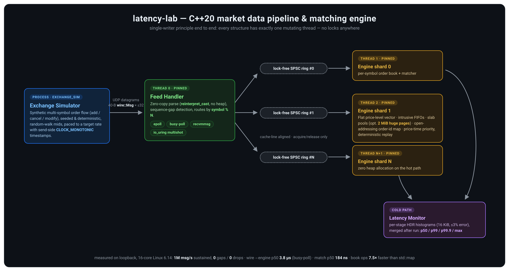

# latency-lab

A high-performance market data pipeline and matching engine in **C++20**, with
built-in latency instrumentation. A simulated exchange streams a binary order
flow over UDP; a feed handler parses it zero-copy into a lock-free ring; a
cache-friendly order book and price-time-priority matching engine process it;
an HDR-style histogram reports per-stage latency percentiles.



## Highlights

- **Lock-free SPSC ring buffer** (`src/common/spsc_ring.hpp`) — monotonic
  indices, cached counterpart indices, cache-line-aligned to kill false
  sharing; acquire/release ordering only. Validated under ThreadSanitizer.
- **Cache-friendly order book** (`src/orderbook/book.hpp`) — flat sorted
  vector of price levels (best at back), intrusive per-level FIFOs, slab
  `ObjectPool` so the hot path never calls `new`/`delete`, and an
  open-addressing `FlatHashMap` (backward-shift deletion) for O(1) order
  lookup. Benchmarked against a `std::map` reference book.
- **Deterministic matching engine** (`src/matching_engine/matcher.hpp`) —
  price-time priority, single-threaded per symbol by design; identical input
  streams produce identical trade tapes (asserted by replay tests).
- **Feed handler** (`src/feed_handler/receiver.hpp`) — four receive
  strategies (epoll, busy-poll, `recvmmsg`, io_uring multishot recv with a
  provided buffer ring), zero-copy `reinterpret_cast` parsing of fixed-layout
  datagrams, sequence-gap detection. Latency comparison in
  [docs/benchmarks/receive_modes.md](docs/benchmarks/receive_modes.md).
- **Multi-symbol sharding** — one receiver thread routes messages by symbol
  into per-engine SPSC rings; each engine thread owns its books outright.
  9M msgs at 1M msg/s across 4 engines with zero loss and zero locks.
- **Huge-page backed pools** — slab allocations can use 2 MiB pages
  (MAP_HUGETLB → THP → normal fallback chain) to cut dTLB pressure.
- **Latency histogram** (`src/monitoring/histogram.hpp`) — HDR-style
  log-linear buckets, flat 16 KiB array, ≤ ~3% relative error, allocation-free
  `record()`.
- **Correctness discipline** — differential tests against naive reference
  implementations (`std::map` book, `std::unordered_map`), randomized
  invariant checks (book never crossed), CI matrix with ASan/UBSan and TSan.

## Build & test

Requires CMake ≥ 3.16 and a C++20 compiler (GCC 12+ / Clang 15+).

```bash
cmake -S . -B build -DCMAKE_BUILD_TYPE=Release
cmake --build build -j"$(nproc)"
ctest --test-dir build --output-on-failure
```

Sanitizer builds:

```bash
cmake -S . -B build-tsan -DCMAKE_BUILD_TYPE=Debug -DLAB_SANITIZE=thread
cmake -S . -B build-asan -DCMAKE_BUILD_TYPE=Debug -DLAB_SANITIZE=address
```

## Run the pipeline

Terminal 1 — the consumer (`--mode epoll|busy-poll|recvmmsg|io_uring`,
`--engines N` for symbol-sharded engine threads, `--rx-cpu`/`--engine-cpu0`
to pin, `--huge-pages` for 2 MiB pool slabs):

```bash
./build/latency_lab --port 9100 --duration 15 --mode busy-poll \
    --engines 4 --rx-cpu 2 --engine-cpu0 4 --huge-pages
```

Terminal 2 — the exchange simulator (500K msg/s for 10 s, 8 symbols):

```bash
./build/exchange_sim 127.0.0.1 9100 500000 10 42 8
```

The consumer prints a per-stage latency report. Measured on a commodity Linux
desktop (epoll mode, no pinning, 300K msg/s over loopback):

```
=== latency-lab report (10.0s) ===
messages: 2399998 (239916 msg/s)   trades: 453209
stage (ns)                  count       mean        p50        p99      p99.9        max
wire->engine              2399998      18163       4736      12544    4980736   11377727
engine (match)            2399998        188        152        656       1024   11371846
receiver: packets=1911292 messages=2399998 gaps=0 ring_full=0
```

## Order book benchmark

```bash
./build/book_bench 5000000 100
# cache behavior:
perf stat -e cache-misses,cache-references ./build/book_bench
```

Compares the flat/intrusive `OrderBook` against the `std::map`-based
`ReferenceBook` on an identical random add/cancel/modify stream. Measured
(GCC 14, `-O3 -march=native`, 2M ops, ~100 levels/side):

| Book | ns/op | ops/s |
|---|---|---|
| flat `OrderBook` (pool + intrusive lists) | ~99 | ~10.1M |
| `std::map` `ReferenceBook` | ~743 | ~1.35M |

Cachegrind attributes the 7.5x to 3.1x fewer data references and 2.9x fewer
D1 misses per operation — full analysis in
[docs/benchmarks/orderbook_cache.md](docs/benchmarks/orderbook_cache.md).

## Layout

```
src/
  common/           types, wire format, SPSC ring, object pool (huge-page slabs), flat hash map, timing, affinity
  exchange_sim/     synthetic multi-symbol flow generator + UDP sender
  feed_handler/     epoll / busy-poll / recvmmsg / io_uring receiver, zero-copy parser, sharded sink
  orderbook/        flat order book + std::map reference (oracle & baseline)
  matching_engine/  price-time priority matcher
  monitoring/       HDR-style histogram + report printer
  pipeline/         latency_lab main (receiver thread + N sharded engine threads)
tests/              GoogleTest suite incl. differential, replay & loopback receiver tests
benchmarks/         book_bench (flat book vs std::map, per-book cachegrind runs)
docs/               design notes + benchmark writeups
```

The io_uring mode uses liburing (system install if found, otherwise built
from source automatically); everything else is dependency-free. Disable with
`-DLAB_WITH_IOURING=OFF`.

## Benchmark writeups

- [Receive modes: epoll vs busy-poll vs recvmmsg vs io_uring](docs/benchmarks/receive_modes.md)
  — busy-poll cuts p50 ~30% vs epoll; includes two io_uring pitfalls
  (deferred task-work vs userspace polling, datagram reordering with
  parallel recv SQEs) found and fixed during measurement.
- [Order book cache analysis](docs/benchmarks/orderbook_cache.md) —
  cachegrind evidence for the flat book's 7.5x win, huge-page tail effect,
  4-engine sharding run.
